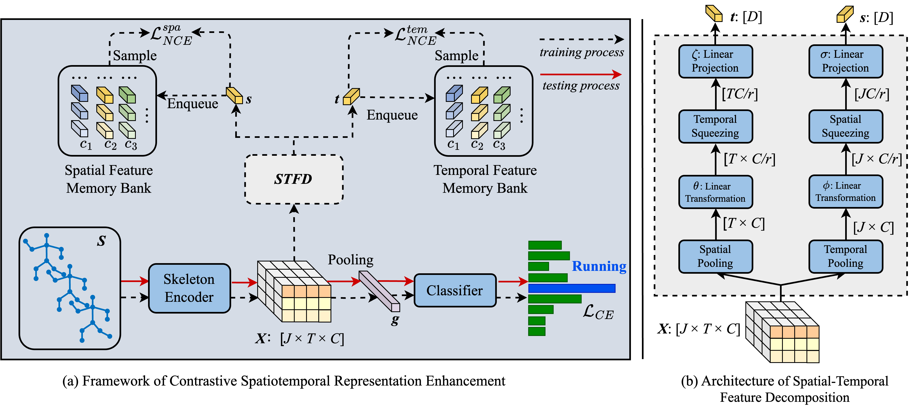

# CSRE
The official implementation of the paper [A Generically Contrastive Spatiotemporal Representation Enhancement for 3D Skeleton Action Recognition](https://www.sciencedirect.com/science/article/pii/S0031320325001815)

## Abstract
Skeleton-based action recognition is a central task in computer vision and human-robot interaction. However, most previous methods suffer from overlooking the explicit exploitation of the latent data distributions (*i.e.*, the intra-class variations and inter-class relations), thereby leading to confusion about ambiguous samples and sub-optimum solutions of the skeleton encoders. To mitigate this, we propose a **C**ontrastive **S**patiotemporal **R**epresentation **E**nhancement (CSRE) framework to obtain more discriminative representations from the sequences, which can be incorporated into various previous skeleton encoders and can be removed when testing. Specifically, we decompose the representation into spatial- and temporal-specific features to explore fine-grained motion patterns along the corresponding dimensions. Furthermore, to explicitly exploit the latent data distributions, we employ the attentive features to contrastive learning, which models the cross-sequence semantic relations by pulling together the features from the positive pairs and pushing away the negative pairs. Extensive experiments show that CSRE with five various skeleton encoders (HCN, 2S-AGCN, CTR-GCN, Hyperformer, and BlockGCN) achieves solid improvements on five benchmarks.

## Architecture


# Preparation

### Download datasets.

#### There are 3 datasets to download:

- NTU RGB+D 60 Skeleton
- NTU RGB+D 120 Skeleton
- NW-UCLA

#### NTU RGB+D 60 and 120

1. Request dataset here: https://rose1.ntu.edu.sg/dataset/actionRecognition
2. Download the skeleton-only datasets:
   1. `nturgbd_skeletons_s001_to_s017.zip` (NTU RGB+D 60)
   2. `nturgbd_skeletons_s018_to_s032.zip` (NTU RGB+D 120)
   3. Extract above files to `./data/nturgbd_raw`

#### NW-UCLA

1. Download dataset from [CTR-GCN](https://github.com/Uason-Chen/CTR-GCN)
2. Move `all_sqe` to `./data/NW-UCLA`

### Data Processing

#### Directory Structure

Put downloaded data into the following directory structure:

```
- data/
  - NW-UCLA/
    - all_sqe
      ... # raw data of NW-UCLA
  - ntu/
  - ntu120/
  - nturgbd_raw/
    - nturgb+d_skeletons/     # from `nturgbd_skeletons_s001_to_s017.zip`
      ...
    - nturgb+d_skeletons120/  # from `nturgbd_skeletons_s018_to_s032.zip`
      ...
```

#### Generating Data

- Generate NTU RGB+D 60 or NTU RGB+D 120 dataset:

```
 cd ./data/ntu # or cd ./data/ntu120
 # Get skeleton of each performer
 python get_raw_skes_data.py
 # Remove the bad skeleton 
 python get_raw_denoised_data.py
 # Transform the skeleton to the center of the first frame
 python seq_transformation.py
```

# Evaluation

coming soon

# Acknowledgements

This repo is based on [2s-AGCN](https://github.com/lshiwjx/2s-AGCN) and [Hyperformer](https://github.com/ZhouYuxuanYX/Hyperformer). The data processing is borrowed from [SGN](https://github.com/microsoft/SGN) and [HCN](https://github.com/huguyuehuhu/HCN-pytorch), the training strategy is based on [InfoGCN](https://github.com/stnoah1/infogcn), and the ensemble strategy is based on [Skeleton-MixFormer](https://github.com/ElricXin/Skeleton-MixFormer).

Thanks to the original authors for their work!

# Citation

Please cite this work if you find it useful:
````BibTeX
@article{zhang2025generically,
  title={A generically Contrastive Spatiotemporal Representation Enhancement for 3D skeleton action recognition},
  author={Zhang, Shaojie and Yin, Jianqin and Dang, Yonghao},
  journal={Pattern Recognition},
  pages={111521},
  year={2025},
  publisher={Elsevier}
}
````